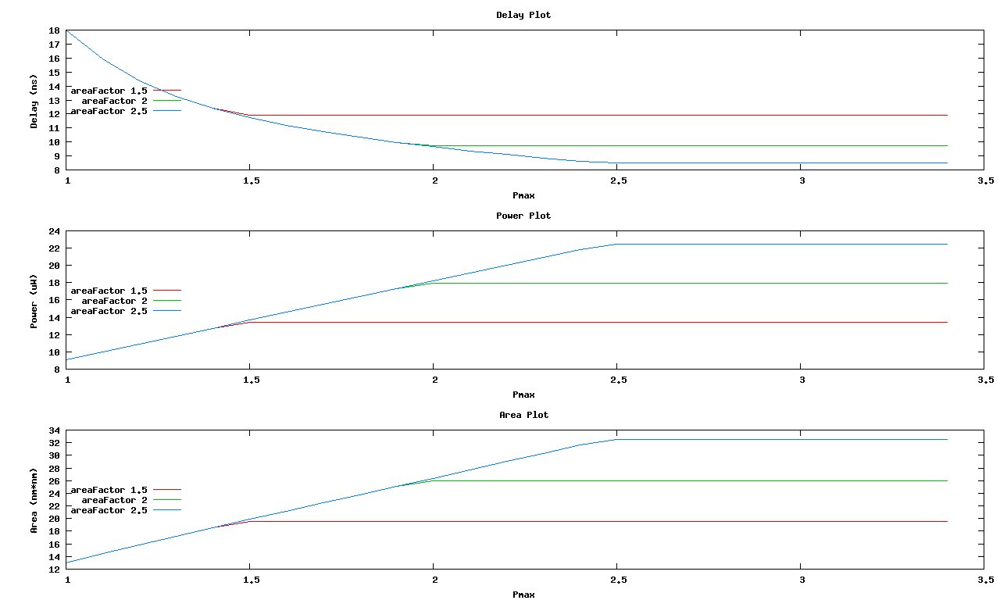

# gate-sizing
Optimal gate sizing of digital circuits using geometric programming.

A C++ program that reads circuit netlists and formulates a geometric program for optimizing gate sizes in terms of power, delay, and area.
Posynomial and monomial classes are used for the constructing geometric programs and may be useful in other problem domains.
In the default configuration it sweeps a range of constraint bounds to generate a trade-off curves as shown in [Sample Results](#sample-results).

This code was featured in the [2012 ICCAD Cadathlon competition](http://www.sigda.org/programs/cadathlon/problems2012).

# Dependencies
Depends upon `gnuplot` for plots, and [Mosek](https://www.mosek.com/)'s exponential optimization solver `mskexpopt` for solving the geometric programs.

# Usage
`./gateSizing benchmarks/circuit.bdnet`

# Sample Results

# Acknowledgements
Based upon the gate sizing geometric programming formulation in Boyd's [A Tutorial on Geometric Programming](http://stanford.edu/~boyd/papers/gp_tutorial.html). 
